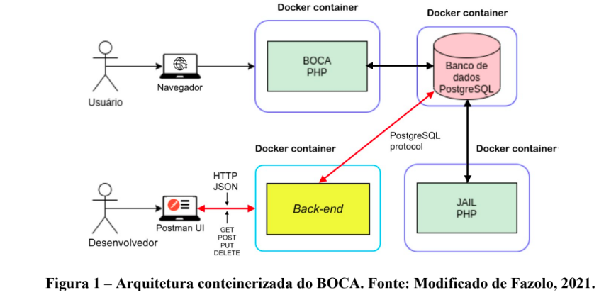
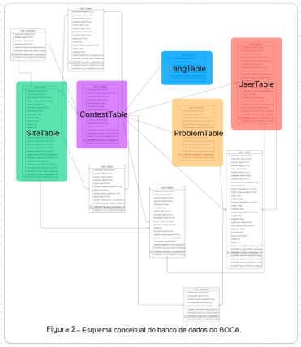
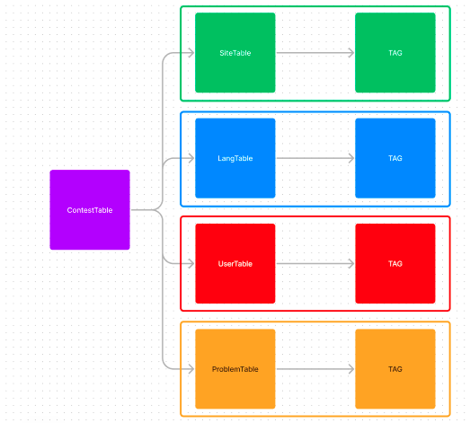
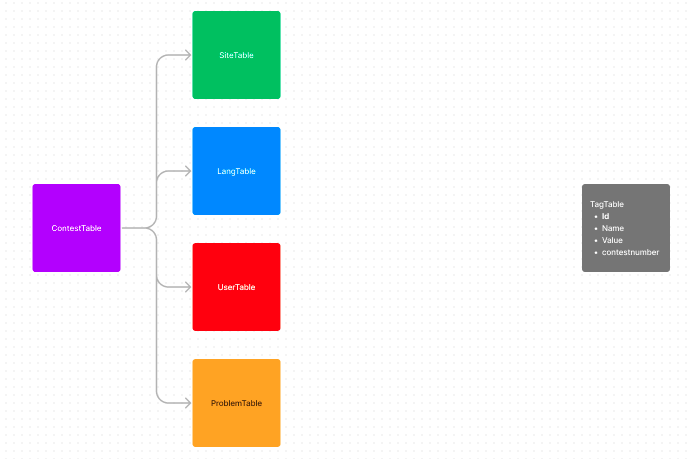

<h1 align="center" style="font-weight: bold; font-size: 40px">
Boca_API
</h1>

<h2 align="center" style=" font-weight: bold; font-size: 20px">
API rest para BOCA 
</h2>
<div align="center"  style="display: row">


 


</div>

<br/>

# 👨🏽‍💻👩🏻‍💻 Autores

* Filipe Gomes Arante de Souza
* Juliana Camilo Repossi

<br/>

# 💻 Pré-requisitos

Para executar a aplicação você precisa:

* Do [Docker](https://www.docker.com/). 
* E, de forma opcional, porém muito útil para realizar as requisições, o [Insomnia](https://insomnia.rest/).

<br/>

# 📃 Sobre

O Boca_api é um microserviço de back-end implementado através de uma API REST, com o objetivo de permitir que as aplicações clientes do BOCA exibam determinados dados com filtros, gerenciados pelo próprio cliente.
A implementação desse microserviço foi feita usando docker e tem como propósito aprimorar a experiência do usuário ao utilizar a plataforma para fins de aprendizagem.

<br/>

# 🔗 Referências

Essa abordagem utilizou como ponto de partida a versão conteinerizada e baseada em microsserviços do BOCA disponível em https://github.com/joaofazolo/boca-docker. 

<br/>

# 🖱️ Executar a aplicação

```bash
# Clonar pasta do projeto
git clone https://github.com/UFES20231BDCOMP/Boca_api
```

```bash
# Com o projeto clonado, precisamos criar um arquivo .env
cat > .env
```

```bash
# Adiconar no .env a variável USER com seu nome de usuário:
USER=seu_user
```

```bash
# Depois disso basta subir o container com o script
./up.sh
```

Com o docker rodando já é possível fazer requisições a API pelo Insomnia. Elas devem obedecer a documentação provida no  [swagger](http://localhost:49160/docs/). E, para visualizar as modificações no banco, é só acessar o [Adminer](http://localhost:8080/).

Ao finalizar, deve-se encerrar o container, com o script:

```bash
./down.sh
```

<br/>

# 📐 Arquitetura 

Será desenvolvido um container contendo o Back-end proposto, no qual este se comunicará diretamente com o banco do BOCA.

<div align="center">

</div>

<br/>

# 🎯 Principais Funcionalidades

As funcionalidades implementadas nesse back-end visam realizar um CRUD básico de tags, sendo assim possuem rotas de :

* Visualização de tags
* Criação de tags 
* Atualização de tags
* Deleção de tags

Todas essas funcionalidades podem ser aplicadas em um contexto específico do BOCA, que é materializado pelo valor do contestnumber, e são direcionadas a determinadas entidades do banco de dados. As entidades escolhidas para usufruir dessas funcionalidades são as relacionadas com as seguintes tabelas:

* ProblemTable
* LangTable
* SiteTable
* UserTable

<br/>

<div align="center">

</div>

<br/>

Esse é o esquema relacional do banco de dados do BOCA, a partir do qual podemos identificar as quatro entidades que serão alvo da nossa implementação, juntamente com a tabela ContestTable. Essa tabela será incluída nesse estudo por ser o elo de ligação entre todas as outras entidades e, por conter o contestnumber, que terá sua importância detalhada nas próximas sessões.

<br/>

# 💻 Implementação

Antes de implementar o próprio Back-end com um CRUD de tags para serem utilizadas nas respectivas entidades do banco, é preciso criar uma arquitetura de armazenamento desses novos dados no sistema.

<br/>

# Arquitetura escolhida para o banco

Ao analisarmos o banco de dados, podemos observar que todas as entidades estão diretamente associadas à entidade ContestTable. Essa entidade contém todos os workspaces existentes no BOCA, sendo definida pela sua chave primária, o contestnumber. Dessa forma, um usuário do sistema tem acesso a, no máximo, todos os dados restritos ao seu próprio workspace. Logo, a entidade Tag que será adicionada obedecerá ao mesmo princípio.

Outra característica que fica evidente pela imagem é que as tabelas das quatro estidades escolhidas são independentes entre si e então subpartes diferentes do banco de dados. Isso nos permite identificar um domínio no qual teremos uma ou mais tags para cada umas das entidades. O que nos leva a uma ideia inicial de arquitetura.

<br/>

# Proposta Inicial

<br/>
<div align="center">

</div>
<br/>

Essa arquitetura pode ser considerada viável para o projeto em geral, porém apresenta algumas limitações quando analisamos a modelagem do dados do banco. A principal questão está relacionada às redundâncias existentes ao utilizar a mesma estrutura da tabela TAG em quatro contextos distintos. Essa abordagem introduz uma complexidade maior na manutenção do código, uma vez que seria necessário criar uma nova tabela TAG para cada nova entidade adicionada ao banco de dados do BOCA, ou para cada entidade escolhida para implementar a estrutura de filtros.


Além disso, essa abordagem pode levar a um aumento significativo da complexidade e da quantidade de código necessário para gerenciar as tabelas TAG. Pois, a inserção de uma nova característica na tabela TAG exigiria modificação em todas as tabelas relacionadas, o que é ineficiente e propenso a erros.

Portanto, é recomendado reavaliar a modelagem dos dados do banco, buscando uma abordagem mais eficiente e escalável, que evite redundâncias desnecessárias e facilite a manutenção e expansão do sistema no futuro. Isso pode envolver a criação de estruturas de dados mais flexíveis e uma melhor normalização do esquema relacional.
Essa modelagem poderia ser mais justificada se houvesse a necessidade de características diferentes para cada tabela TAG relacionada a cada entidade, mas esse não é o caso.

<br/>

# Proposta Refinada

A primeira escolha de refinamento feita foi modularizar a tabela de Tags pelo motivo supracitado.

<br/>
<div align="center">

</div>
<br/>

A tabela Tag conta com os campos de :

* Id: chave primária da tabela. Pode ser cadastrada com o valor fornecido, conforme a especificação do projeto, ou gerada. Essa escolha foi feita devido ao fato de que o campo "id" é apenas um campo de controle interno da tabela no banco de dados. Portanto, não possui uma utilidade direta para o usuário final. Delegar essa geração ao sistema é mais adequado para uma aplicação cliente que opera nesse contexto, porém para manter as consultas requeridas, foi preciso abrir mão dessa convenção em algumas rotas para atender ao trabalho. Essa abordagem ofereceria mais simplicidade e segurança para a aplicação.

* Name e Value: as colunas "name" e "value" são o cerne dessa tabela. Elas definem uma combinação única de dados. Devido à escolha de projeto de ter o campo "id" como uma variável de controle invisível para o usuário, ao criar uma tag para uma entidade com um nome e valor já existentes no banco, mas com ids diferentes, o sistema permite a inserção da tag na entidade. No entanto, não cria uma nova tag, apenas estabelece a conexão entre o id da tag existente, de mesmo nome e valor, e a entidade em questão. O tratamento é análogo para as operações de update e delete.

* Contestnumber: que está presente com a finalidade de isolar os valores de tags de cada um dos ambientes, assim como todas as entidades do BOCA, conforme o funcionamento da aplicação. Dessa forma, mantemos a lógica macro de modelagem do banco, garantindo o isolamento, a consistência e a segurança dos dados.

Agora precisamos estabelecer uma relação entre cada uma das entidades e a tabela Tag. Como essa relação é do tipo muitos para muitos, já que uma tag pode estar relacionada a mais de uma instância de cada uma das entidades e, uma instância de uma entidade pode ter mais de uma tag, vamos criar uma tabela intermediária para fazer esse relacionamento, esta será a tabela EntityTagTable.

Essa é a parte mais crítica do projeto desse microserviço, uma vez que este relacionamento precisa conectar uma Tag, da tabela de tags, a apenas uma entre as quatro tabelas de entidades alvo. Isso requer algum nível de redundância no projeto, uma vez que a implementação desse relacionamento foi feita usando chaves estrangeiras, e uma chave estrangeira só pode apontar para uma entidade específica, nesse caso, uma tabela. Assim, precisaremos de quatro chaves estrangeiras, uma para cada tabela.

Diante dessas considerações, chegamos a um esboço preliminar do esquema:

<br/>
<div align="center">

</div>
<br/>

Escolhemos essa modelagem devido ao grau de confiança, modularização, bom uso de memória e aplicação prática que ela faz, mediante as demais possíveis.

Essa modelagem foi obtida a partir dessas decisões:

* A primeira decisão foi de manter uma chave estrangeira para cada uma das entidades que implementariam o uso de tags. Isso se justifica pela intenção de manter integro o cnjunto de dados armazenados, uma vez que ao deletar uma instância de uma entidade em um contexto, todas as relações da tabela entitytagtable seriam removidas em cascata. Essa escolha também foi feita para referenciar a tag.

    As colunas ("entityidsite"), ("entityidlanguage"), ("entityiduser", "entityidusersite"),("entityidproblem") combinada com a coluna ("contestnumber") compõem cada uma das quatro chaves estrangeiras para as tabelas sitetable, langtable, usertable e problemtable, respectivamente. Essa combinação de campos trata-se da chave primária de cada uma dessas tabelas e cada linha terá exatamente uma dessas combinações não nula.

* O valor de tag foi referenciado com uma chave estrangeira também para manter a a integridade do banco, no qual ao excluir o valor de uma tag de um contexto, deverá também ser excuido todas as relações associadas a essa tag. Essa modularização também traz a vantagem de diminuição do uso de memória.

* Por fim, foi adicionada uma coluna id com seu valor gerado de forma artificial para compor a chave primária dessa tabela de relações. Essa escolha foi necessária pois essa entidade armazena uma relação de cardinalidade muitos para muitos, logo o correto seria que a chave primária natural fosse composta pela junção das chaves primárias das entidades envolvidas na relação. Porém, em especial nessa solução, não era possível manter esse padrão de projeto, já que teríamos cinco chaves estrangeiras diferentes que poderiam compor a chave primária, e , em cada instância teríamos apenas duas delas não nulas, uma de entidade e uma de tag. Como a chave primária não pode ter valores nulos optamos pelo uso da chave artificial.

<br/>

# 🚀 Rotas definidas para o CRUD de tags

Para aplicar esse microserviço, foram desenvolvidas 8 rotas.

* Duas rotas GET, para a exibição das tags relacionadas a instâncias de entidades;
* Uma rota PUT, para a atualização de tags relacionadas a instâncias de entidades;
* Uma rota POST, para a criação de tags para instâncias de entidades;
* Duas rotas DELETE, uma para a deleção de uma tag de uma instância de entidade e outra para a deleção de uma tag de um contexto;

* E, duas rotas GET para filtrar as instâncias de uma entidade por um valor e ou nome de uma tag passada; 

Foi desenvolvido uma documentação simplificada para detalhar cada uma dessas rotas com seus respectivos parâmetros e retornos através da ferramenta swagger, que encontra-se em [Documentação](http://localhost:49160/docs).

<br/>

# 🚀 Funcionalidades adicionais 

Foram desenvolvidas algumas funcionades extras para o projeto, sendo elas:

* Uso de ROLLBACK, que permite realizar requisições múltiplas ao banco de dados de forma segura. Se ocorrer uma falha em uma das requisições, as demais não serão executadas, garantindo a integridade dos dados. Essa abordagem facilita a testabilidade do projeto e a identificação de erros, tornando o processo de lançamento mais eficiente.

* Implementação de middleware de parâmetros de uma requisição antes de serem enviadas ao Controller, utilizando o pacote celebrate, para todas as rotas implementadas.

* Desenvolvimento de testes automatizados das rotas de CRUD de tags e das rotas GET dos filtros de entidades. 

```bash
# Para executar os testes basta executar o script :
./test.sh
```